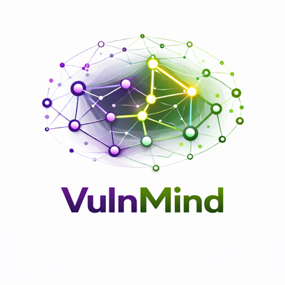

  

VulnMind is a semantic framework for representing vulnerabilities, software assets, and security logs. It semantically links CVEs, system components, configurations, and log evidence to support knowledge graph construction, automated reasoning, and ML/LLM-based cybersecurity analysis and situational awareness.
